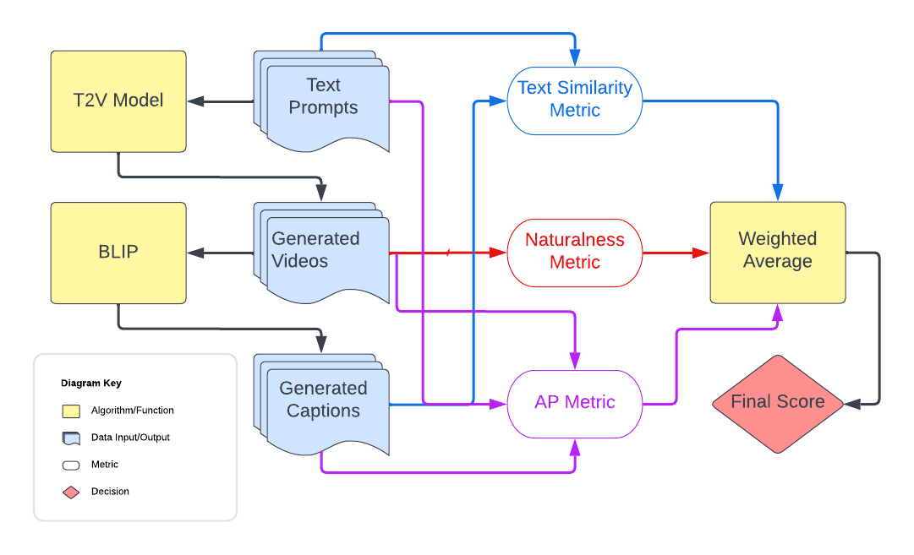
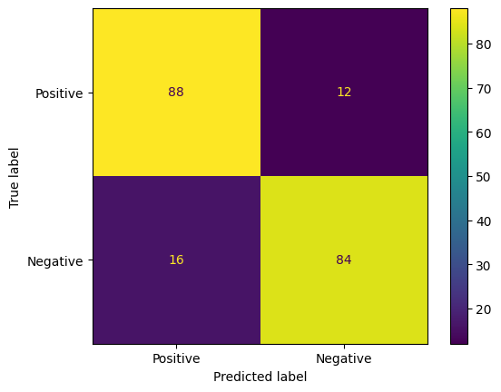
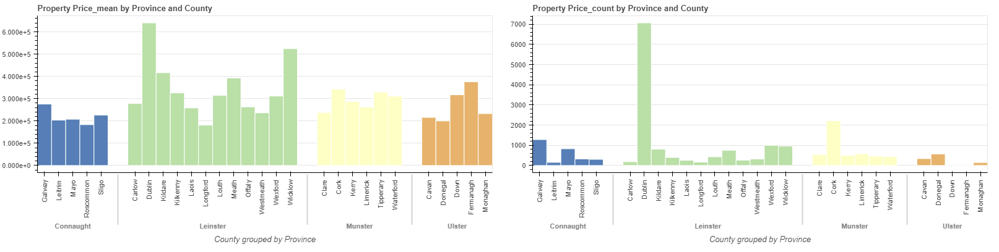
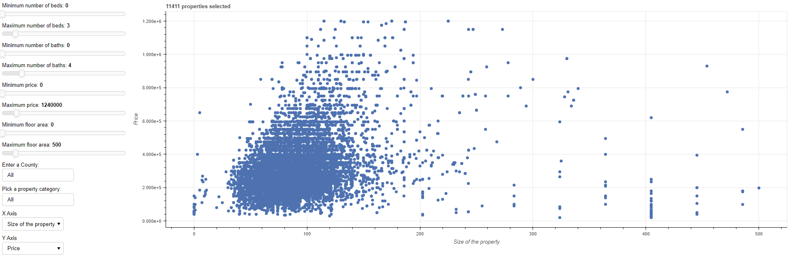

# Philip Lynch

## Introduction

My name is Philip Lynch, I am currently a 4th-year Data Science student at Dublin City University (DCU). I am currently looking for summer work and eager to learn new things  
My contact details are:  
Email: philip.lynch35@mail.dcu.ie  
[LinkedIn](https://www.linkedin.com/in/philip-lynch-m35/)

# Project 01: Evaluating Text-to-Video Models
# Evaluating Text-to-Video Models

This project represents a convergence of machine learning, video and image processing, and natural language processing (NLP) in pursuit of a novel and innovative quality evaluation metric for video output from text-to-video models. The project combines a custom-built image naturalness and human interpretability classifier with advanced text similarity techniques to produce more precise and dependable performance scores. This initiative employs the latest state-of-the-art image generation and processing technology to enhance user experience and elevate quality of generated videos.

Our paper covering our work can be found [here](assets/Chivileva_Lynch_FinalYearProject.pdf).

## About the Project

The metric workflow shown above, can be divided into two parts.
The first part involves data generation, depicted in blue and yellow boxes on the left-hand side of the figure. Starting with an initial text prompt, we generate a video using a T2V model. Then, we use the generated video to produce a list of captions using BLIP-2.
The second part involves the ensemble of three metrics, which starts with the Text Similarity Metric presented in Text Similarity, this metric calculates the similarity score between the original text prompt and the BLIP-generated captions, ranging from 0 to 1. Next, we use the Naturalness Metric this measures how realistic and natural an video appears. Lastly, Average Precision is calculated using the objects in the video based on the original prompt and the BLIP-generated captions, with a possible range of 0 to 1.

---
## Project Highlights
The study highlights the constraints of the current evaluation metrics used in the literature, identifying the need for a new evaluation metric that addresses these limitations. Our main contribution is a proposed evaluation metric which involves addressing two critical challenges: image naturalness and semantic matching. Our research demonstrates that the novel metric outperforms a commonly used metric, indicating that it is a reliable and valid evaluation tool.

# Project 02: Artist Recommender System

The goal of this project was to build an artist recommendation system based on the last FM dataset. The dataset can be found through this [link](https://grouplens.org/datasets/hetrec-2011/).

My work can be split into four main parts.

1. The first part is my initial analysis of the data ([01_initial data_analysis.ipynb](https://github.com/lynchp35/DS_4th_Year/blob/main/CA4015/Assignment%203%20Recommender%20Systems/01_initial_data_analysis.ipynb "Python Notebook")), here I do some simple cleaning and pre-processing of the data using the Python libraries Pandas for data manipulation, Matplotlib and Seaborn for data visualisation.
2. The next part includes two Python scripts web_scraper.py and web_scraper_tags.py, both scripts are used to scrape additional data from the last FM website. The additional data that I scraped included the top genres related to an artist and similar artists. To be able to scrape this data I used the Python library BeautifulSoup.
3. The third part can be found in the notebook [02_further_data_analysis.ipynb,](https://github.com/lynchp35/DS_4th_Year/blob/main/CA4015/Assignment%203%20Recommender%20Systems/02_further_data_analysis.ipynb) I used this notebook to do further analysis of the processed data and also looked at the additional scraped data.
4. The final and most interesting part is the recommendation system found in the notebook [recommender_system.ipynb.](https://github.com/lynchp35/DS_4th_Year/blob/main/CA4015/Assignment%203%20Recommender%20Systems/recommender_system.ipynb) The motivation that I had for this notebook was to create a similar user experience to the setup process of Spotify. I wanted to create an interactive application where a user can input data on themselves such as their favourite music genres, artists, and their rating of them. To be able to make an interactive application I used the Python libraries Ipywidgets and IPython.  After collecting the new user's data I used different methods for artist recommendation:
   1. The first method is content-based filtering, which involved using pre-trained word embedding from the library SentenceTransformer. I used the user's favourite genres and the genres of the artists to compute a similarity score between them. I then return the top 20 most similar artists based on their scores.
   2. The second method used collaborative filtering, this time I used the library Suprise and the Singular Value Decomposition(SVD) model. This model aims to recommend artists to a user based on the assumption that similar users like similar artists. i.e If user1 likes artist1, artist2 and user1 likes artist1, artist2, artist3, user1 may also like artist3.

Below I show how I used Ipywidgets and IPython to collect the user's data.

Example recommendation using content-based filtering.

# Project 03: Film Review Sentiment Analysis.

The goal of this project is to develop a Naïve Bayes classifier to analyse the sentiment of a film review. The data used was provided [Cornell](https://www.cs.cornell.edu/people/pabo/movie-review-data/), which includes 2000 reviews evenly split between the two classes, negative or positive. The project involves five main parts these are:

1. Pre-processing, the code for this can be found in the Python script [pre_processing.py](). This file pre-processes the film reviews depending on the parameters passed, the possible parameters are;

   * Keep Unique: This can be either True or False, if True I only keep the uniquewords and their count as 1 in a review else I save the words with their counts.
   * Remove Punctuation: This can be either True or False, if True I remove all punctuation in the reviews else I don't.
   * Expand Negation: This can be either True or False, an example sentence of how to expand Negation works is input("I don't know how I passed. Well how did you do?") -> output("I do not_know not_how not_I not_passed. Well how did you do?"). If false the file doesn't change anything.
2. Once the film reviews have been process I train and evaluate the model using the Python scripts training.py and evaluate.py. The training script has one tuneable parameter and this is the alpha value used for [Laplace smoothing](https://towardsdatascience.com/laplace-smoothing-in-na%C3%AFve-bayes-algorithm-9c237a8bdece).

   1. This is the value used for Laplace smoothing, as seen below. Laplace smoothing is used to account for words that appear in one class but not the other. The range of values for alpha used in the python script are [0.01,0.1,0.25,0.5,0.75,1.0, 2.0].
3. Cross-validation, through the python script cross_val_training.py I pick the hyper-parameters for the Naïve Bayes model using 10-fold cross-validation.

   This script imports the classes from the files:

   1. pre_processing.py: this file pre-processes the film reviews depending on the parameters passed.
   2. training.py: this file trains the pre-processed files, the training set is determined by the parameter passed, and also takes in an alpha value for laplace smoothing.
   3. evaluate.py: this evaluates the test set using the trained model created by training.py, the test is also determined by the parameter passed.
4. main.py, this script is used to train and evaluate the Naive Bayes model with either the base hyper-parameters or the tuned parameters found in the cross-validation script.

## Results

In this section, I will showcase the accuracy achieved by various hyper-parameters and the final accuracy on the unseen test set.

The hyper-parameter tuning with the cross-validation script was split into two parts:

1. First I tuned for the pre-process parameters.
2. Then I tuned for alpha in the training file.

### Pre-processing hyper-parameter accuracy

Most parameters had similar accuracy but I decided to continue with the parameters:

* Keep Unique (ku): True
* Remove Punctuation (rp): False
* Expand Negation (exn): True

### Training hyper-parameter accuracy

### Test set accuracy

I then finally evaluated the model using the unseen test set. I trained the model using the following tuned hyper-parameters:

* Keep Unique (ku): True
* Remove Punctuation (rp): False
* Expand Negation (exn): True
* Alpha (a): 2.0

This model achived an accuracy of 86% and had the confusion presented below:

# Irish Property Price Analysis

For this project, my goal was to create a single novel housing dataset from https://www.myhome.ie and https://www.daft.ie. The housing market is a major concern for many individuals and families in Ireland. My motivation is to provide statistics and build a better tool for homebuyers and help them gain a better understanding of the factors that influence housing prices. We aim to develop a dataset that aims to provide users that are searching for homes and different property types an easy and efficient way to search for these properties and find information relating to the prices and areas in Ireland.

The main components of this project involved, scraping the house data, cleaning the data and creating an interactive visualisation that potential users could easily use to help them make a more informed decision before buying a property.

1. The data was scraped using the Python library Beautifulsoup. [GitHub Repo](https://github.com/lynchp35/irish_property_analysis/tree/main/web_scrapers)
2. The cleaning processes was done using custom functions built for PySpark dataframes. [clean_all_property_data.py](https://github.com/lynchp35/irish_property_analysis/blob/main/clean_all_property_data.py "clean_all_property_data.py")
3. The interactive dashboards were built with the Bokeh library and I used PSQL as the back to query the results.
   1. The first dashboard was static and built with the Python Script [dashboard.py](https://github.com/lynchp35/irish_property_analysis/blob/main/dashboard.py "dashboard.py"), the script produce the HTML file [static_dashboard.html](https://github.com/lynchp35/irish_property_analysis/blob/main/static_dashboard.html "static_dashboard.html").
   2. The second dashboard allowed the user to query data based on the property they were interested. I built this using the script [interactive_dashboard.py](https://github.com/lynchp35/irish_property_analysis/blob/main/interactive_dashboard.py "interactive_dashboard.py").
      
