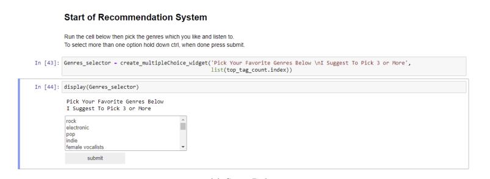
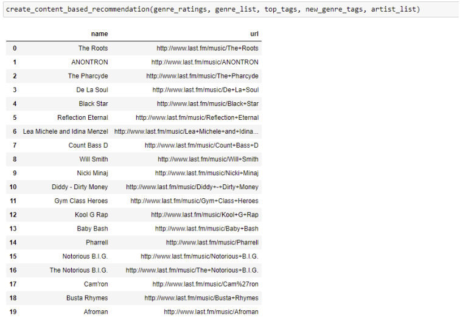

# Project 01: Artist Recommender System

The goal for this project was to build an artist recommendation system based on the last FM dataset. The dataset can be found through this [link](https://grouplens.org/datasets/hetrec-2011/).

My work can be split into four main parts.

1. The first part is my initial analysis of the data ([01_initial data_analysis.ipynb](https://github.com/lynchp35/DS_4th_Year/blob/main/CA4015/Assignment%203%20Recommender%20Systems/01_initial_data_analysis.ipynb "Python Notebook")), here I do some simple cleaning and pre-processing of the data using the Python libraries Pandas for data manipulation, Matplotlib and Seaborn for data visualisation.
2. The next part includes two Python scripts web_scraper.py and web_scraper_tags.py, both scripts are used to scrape additional data from the last FM website. The additional data that I scraped included the top genres related to an artist and similiar artists. To be able to scrape this data I used the Python library BeautifulSoup.
3. The third part can be found in the notebook [02_further_data_analysis.ipynb,](https://github.com/lynchp35/DS_4th_Year/blob/main/CA4015/Assignment%203%20Recommender%20Systems/02_further_data_analysis.ipynb) I used this notebook to do further analysis of the processed data and also looked at the additional scraped data.
4. The final and most interesting part is the recommendation system found in the notebook [recommender_system.ipynb.](https://github.com/lynchp35/DS_4th_Year/blob/main/CA4015/Assignment%203%20Recommender%20Systems/recommender_system.ipynb) The motivation that I had for this notebook was to create a similar user experience to the setup process of Spotify. I wanted to create an interactive application where a user can input data on themselves such as their favourite music genres, artists, and their rating of them. To be able to make an interactive application I used the Python libraries Ipywidgets and IPython.  After collecting the new users data I used differenet methods for artist recommendation:
   1. The first method is a content based filtering, this envolved using a pretrained word embedding from the library SentenceTransformer. I used the users favourite genres and the genres of the artists to compute a similirty score between them. I then return the top 20 most similiar artists based on their score.
   2. The second method used collabortive filtering, this time I used the library Suprise and the Singular Value Decomposition(SVD) model. This model aims to recommend artists to a user based on the assumption that similiar users like similiar artists. i.e If user1 likes artist1, artist2 and user1 likes artist1, artist2, artist3, user1 may also like artist3.

Below I show how I used Ipywidgets and IPython to collect the user's data.

Example recommendation using content based filtering.

# Project 02: Naive Bayes Classifier

In this section I include two main parts.

1. Cross Validation, through the python script cross_val_training.py I pick the hyper-papermeters for the Naive Bayes model used in main.py.

   1. This scripts imports the classes from the files:
      1. pre_processing.py: this file pre-processes the film reviews depending on the parameters passed.
      2. training.py: this file trains the pre-processed files, the training set is determined by the parameter passed, and also takes in an alpha value for laplace smoothing.
      3. evaluate.py: this evaluates the test set using the trained model created by training.py, the test is also determined by the paramter passed.
2. Main, this script is used to train and evaluate the Naive Bayes model with either the base hyper-papermeters or the tuned parameters found the cross validation script.

   1. This takes the same steps as cross_val_training.py but only runs the model once.

## Cross Validation

In this section I will further discuss how this part works.

This file is used to tune the hyper-parameters, I use 10-fold CV on the 1800 training reviews (900 positive, 900 negative). The parameters can be split into two types:

1. Pre-processing paramters:

   1. Keep Unique: This can be either True or False, if True I only keep the unqiue words and their count as 1 in a review else I save the words with their counts.
   2. Remove Punctuation: This can be either True or False, if True I remove all punctuation in the reviews else I don't.
   3. Expand Negation: This can be either True or False, an example sentence of how expand Negation works is input("I don't know how I passed. Well how did you do?") -> output("I do not_know not_how not_I not_passed. Well how did you do?"). If false the file doesn't change anything.
2. Training parameters:

   1. Alpha: This is the value used for laplace smoothing, as seen below. Laplace smoothing is used to account for words that appear in one class but not the other. The range of alpha used in the python script are [0.01,0.1,0.25,0.5,0.75,1.0].

   $$
   \hat{P}(w_i|c) = \frac{count(w_i, c)+\alpha}{(\sum_{w \in V}count(w,c))+\alpha|V|}
   $$

The cross_val_training file takes in the five flags:

1. "-ku": ["True", "False"], this is the value for Keep Unique, used while you tune for alpha
2. "-rp":["True", "False"], this is the value for Remove Punctuation, used while you tune for alpha
3. "-exn":["True", "False"], this is the value for Expand Negation, used while you tune for alpha
4. "-a":[0.01-1], this is the value for alpha if you want to tune for on the paramters 1- 3
5. "-test_alpha":["True", "False"], if "True" the model tunes -a else it tunes -ku, -rp and -exn.

The code below runs the cross validation model with a constant alpha of 1, while it searches for the best hyper-parameters for -ku, -rp and -exn.

`"python .\cross_val_train.py -test_alpha False"`

The scripts starts by pre-processing the film reviews with the current -ku, -rp and -exn paramteres. The processed files are saved as json files with the key, value pairs word and its count. After the model is done pre-processing, training.py takes the pre-processed reviews and trains using 10-fold cross validation, the accuracy and confusin matrix below are calculated by the evaluation.py script on the 180 validation reviews.

Once the cross validation model is done the results are saved to "cross_validation_results/constant_alpha.csv".

If you want to tune alpha you can run the line below. This tunes alpha while keeping -ku, -rp and -exn constant.

`"python .\cross_val_train.py -ku True -rp True -exn False"`

Once the cross validation model is done the results are saved to "cross_validation_results/different_alpha.csv". I will discuss this further in the overview.pdf and the ANALYSIS.md file.

Once I have picked the values for -ku, -rp,-exn and -a. I will train the model using all the training data and evaluate on the unseen test data using the python script main.py.